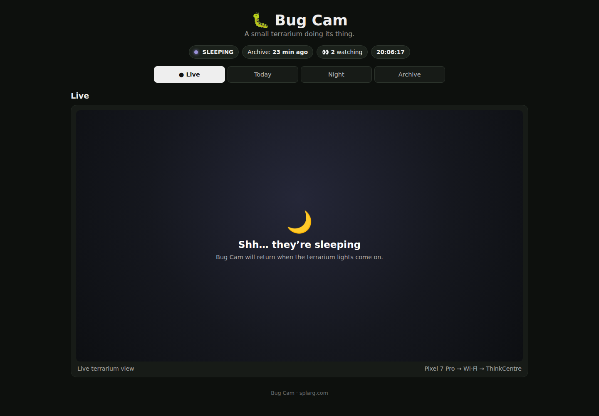

# 🐛 BugCam

BugCam turns an Android phone into a low-power, unattended LAN camera.

It was built for fixed installations where a phone remains powered, can be controlled remotely over Wi-Fi, and must continue working with the display off. BugCam was originally developed for a terrarium camera using a Google Pixel 7 Pro.

**[Open the BugCam site](https://bug.splarg.com/)**

<!-- site-screenshot:start -->

  

<!-- site-screenshot:end -->

## Current design

BugCam now uses an **on-demand camera architecture**.

The foreground service and lightweight HTTP server remain running, but the physical Camera2 device is normally **closed**. An external controller can briefly open the camera, collect a fresh JPEG, and close it again:

    GET /camera/on
    GET /snapshot.jpg
    GET /camera/off

This makes BugCam suitable for scheduled still-image capture without paying the thermal and battery cost of keeping the camera pipeline active continuously.

The reference terrarium deployment uses a Linux ThinkCentre to schedule captures. BugCam itself does not hard-code a capture schedule.

## Why live video was deprecated

BugCam originally kept Camera2 open continuously and exposed a permanent MJPEG live view.

That worked functionally, but it was a poor fit for a permanently powered Pixel 7 Pro. Continuous Camera2 capture kept both BugCam and Android's camera provider busy even when nobody was watching. In the terrarium deployment this produced sustained heat, high camera-related CPU use, and eventually Android thermal charging mitigation: the phone could be plugged into mains while barely charging or not charging at all.

The architecture was therefore changed from **always-on live video** to **brief on-demand capture**.

In testing on the Pixel 7 Pro, the new design reduced the phone to an essentially idle state between photographs: the camera service reported no active camera client, thermal status returned to normal, battery temperature fell into the low 30s °C, and normal charging resumed. These figures describe the development device rather than a universal benchmark, but the design principle is general: if a fixed camera only needs periodic photographs, keeping the sensor and Camera2 pipeline open continuously wastes power and creates heat for no useful benefit.

The public terrarium site now shows the **latest captured image** rather than maintaining an always-on video connection.

A legacy /stream endpoint remains available for short diagnostic use while the camera is open, but continuous streaming is no longer the intended unattended operating mode.

## Features

- Rear-camera capture using Camera2
- Physical camera normally closed between captures
- Full 1920×1080 JPEG snapshots
- On-demand /camera/on and /camera/off control
- 15-second camera-open safety timeout
- JSON health/status endpoint
- Camera foreground service
- Continues serving control/health requests with the display off
- Android Direct Boot support
- Remote launch using ADB after reboot
- Persistent manual focus
- Persistent exposure compensation
- Browser-based camera tuning page
- 1920×1080 test-shot preview and full-size JPEG download
- Torch on/off control
- Adjustable torch strength on supported devices
- Battery and thermal reporting
- Camera recovery/watchdog logic
- JPEG quality 85 by default
- Small bounded HTTP server
- Legacy MJPEG stream for short diagnostic use

## Tested configuration

BugCam has been tested on:

- Google Pixel 7 Pro
- Android 17 / API 37
- Rear camera
- 1920×1080 capture
- JPEG quality 85
- Camera configured for 10 fps publication while temporarily open
- Sensor AE range selected by the device, commonly 15–15 fps on the tested Pixel
- Wi-Fi LAN control
- Continuous mains power
- Camera closed while idle

Other Android devices may work, but have not been tested to the same extent.

## Requirements

For building:

- JDK 17
- Android SDK 37
- Linux, macOS or Windows
- Gradle wrapper included

The app targets Android API 37 and has a minimum SDK of 28.

## Build

Clone the repository:

    git clone https://github.com/splargdotcom/BugCam.git
    cd BugCam

Create local.properties if your Android SDK is not automatically detected:

    sdk.dir=/path/to/Android/Sdk

Build with Gradle:

    ./gradlew assembleDebug

Or on Ubuntu/Linux:

    ./scripts/build-ubuntu.sh

## Install

Install with ADB:

    adb install -r app/build/outputs/apk/debug/app-debug.apk

Launch BugCam:

    adb shell am start \
      -n com.splarg.bugcam/.MainActivity \
      --ez auto_start true

Grant camera and local-network permissions when requested on first installation.

## HTTP interface

BugCam listens on port 8080 by default.

For a phone at 192.168.1.50:

    http://192.168.1.50:8080/

The root page provides status information, focus/exposure tuning and a test-shot workflow.

### Recommended capture transaction

Open the physical camera:

    curl http://192.168.1.50:8080/camera/on

Allow the camera briefly to settle, then request a JPEG:

    curl http://192.168.1.50:8080/snapshot.jpg -o bugcam.jpg

Close the camera:

    curl http://192.168.1.50:8080/camera/off

The camera also has an internal **15-second maximum-open failsafe**. If a controller crashes, Wi-Fi drops, or the matching /camera/off request never arrives, BugCam closes Camera2 automatically.

### Health

    GET /health

Returns JSON containing camera state, frame counts, resolution, frame age, battery and thermal information, HTTP state, focus information and torch state.

Example:

    curl -s http://192.168.1.50:8080/health | python3 -m json.tool

In on-demand mode, this is the normal idle state:

    "camera_active": false
    "camera_state": "idle"

An idle camera is intentional, not an outage.

### Snapshot

    GET /snapshot.jpg

Returns the most recent **fresh** JPEG frame. If the camera is closed and no fresh frame is available, the endpoint returns HTTP 503 rather than pretending an old image is current.

### Camera control

Open Camera2:

    GET /camera/on

Close Camera2 while leaving the BugCam service and HTTP server running:

    GET /camera/off

### Camera tuning

The built-in status page can save focus and exposure settings and take a temporary test photograph.

Manual focus can also be set through the HTTP API:

    GET /focus/set?diopters=7.707

Read the saved focus value:

    GET /focus/get

Exposure compensation uses Camera2 native steps. On the tested Pixel these are 1/6 EV per step:

    GET /exposure/set?steps=3
    GET /exposure/get

Saved focus and exposure values are stored in device-protected preferences and are applied automatically when later camera sessions are opened.

### Torch

Turn the torch on:

    GET /torch/on

Turn it off:

    GET /torch/off

On supported Android versions and camera hardware, set the torch strength:

    GET /torch/on?level=1

The available range is reported by /health.

### Legacy MJPEG stream

    GET /stream

The stream endpoint is retained for short testing and diagnostics. It requires a fresh active camera feed and is deliberately **not** the recommended permanent operating mode.

If you need it temporarily:

    curl http://192.168.1.50:8080/camera/on
    ffplay -fflags nobuffer http://192.168.1.50:8080/stream

Close the camera afterwards:

    curl http://192.168.1.50:8080/camera/off

The 15-second failsafe still limits how long a forgotten camera session can remain open.

## Screen-off operation

BugCam runs as a foreground camera service, but that does **not** mean Camera2 must remain active.

With the display asleep, the service can continue to:

- listen on the LAN
- answer /health
- accept camera control requests
- open Camera2 for a requested photograph
- close Camera2 again afterwards

BugCam does not hold a CPU wake lock merely to keep the display awake.

## Reboot and Direct Boot

BugCam does not automatically start itself from BOOT_COMPLETED.

The intended unattended setup is for another machine on the LAN to launch it using wireless ADB after the phone reboots:

    adb shell input keyevent KEYCODE_WAKEUP

    adb shell am start -W \
      -n com.splarg.bugcam/.MainActivity \
      --ez auto_start true

    adb shell input keyevent KEYCODE_SLEEP

On the tested Pixel 7 Pro / Android 17 setup, BugCam can start its service before the first manual unlock after reboot.

See scripts/launch-adb.sh for an example.

## External scheduling

BugCam intentionally separates **camera control** from **capture scheduling**.

A separate machine can decide when to take photographs without requiring the Android app to remain busy between captures. The reference terrarium installation uses this model for frequent daylight photographs and less frequent torch-lit night photographs.

A controller should always use a transaction shaped like:

    camera on → settle → snapshot → camera off

The app-side 15-second failsafe is a final safety net, not a replacement for closing the camera normally.

## Soak testing

A soak-test helper is included:

    python3 scripts/soak-test.py \
      http://192.168.1.50:8080 \
      --minutes 60

If using the legacy stream during a short diagnostic test, add --stream.

## Security

BugCam is intended for use on a trusted private LAN.

The built-in HTTP server currently provides no authentication or TLS. Do not expose port 8080 directly to the public internet.

For remote access, use an appropriate authenticated VPN, reverse proxy or other access-control layer.

## Thermal considerations

The current design exists specifically to avoid unnecessary continuous camera load.

Camera2, image processing and JPEG encoding still use significant power while the camera is open, so for permanent installations:

- keep camera sessions short
- close the camera immediately after obtaining the required frame
- retain the automatic open-time failsafe
- provide reasonable airflow
- avoid insulating the phone
- monitor battery temperature and Android thermal state through /health

For periodic monitoring, reducing **camera duty cycle** is generally much more effective than merely reducing JPEG quality or publication frame rate while leaving Camera2 open continuously.

## Architecture

The current design separates:

- CameraController — owns short-lived Camera2 sessions
- FrameStore — holds the latest encoded JPEG
- WifiHttpHost — manages LAN binding
- BugCamHttpServer — serves status, control, snapshots and optional diagnostic streaming
- persisted focus/exposure state — reused by later camera sessions

See ARCHITECTURE.md for lower-level implementation notes.

Testing information is in TESTING.md.

## License

BugCam is released under the MIT License. See LICENSE.
